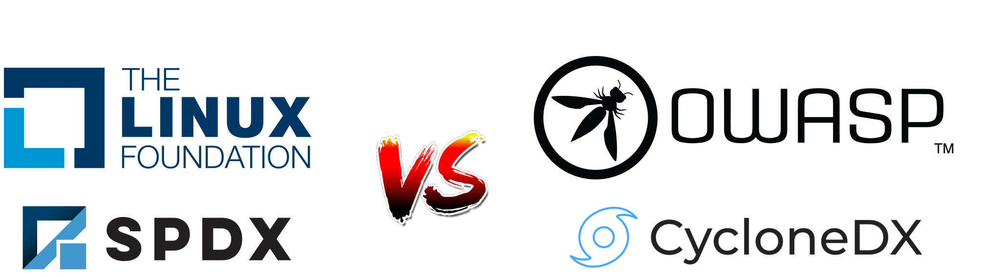

[%notitle]
== SolarWinds

[.step]

SolarWinds

[.notes]
--
* entreprise américaine de logiciels *spécialisés dans la gestion et surveillance* des infrastructures informatiques
* mi 2020, beaucoup de clients, dont des agences gouvernementales
* Décembre 2020, pirates s'infiltrent dans le réseau de SolarWinds
* Accès à l'environnement de build, CI/CD
* insertion de code malveillant dans une mise à jour
--

=== Bilan de l'attaque

[.step]
* 👾 18 000 clients, 9 agences gouvernementales 👾
* Perte de réputation et confiance 📉
* Perte de clients 👋
* 40 millions de dollars de perte 💲💲💲

[.notes]
--
* y'a quand même eu un point positif ...
--

[%notitle]
=== Décret sur l'amélioration de la cybersécurité nationale

image::images/uncle_biden.png[background, size=contain]

[.notes]
--
* Mai 2021, Décret sur l'amélioration de la cybersécurité nationale
* but : améliorer la sécurité des logiciels utilisés par le gouvernement fédéral
* rendre obligatoire : les dépendances utilisées
* Software Bill of Materials - SBOM
* surtout quand on sait qu'environ 70 à 90% du code est du code open source selon Linux Fondation
* sécuriser la chaîne d'approvisionnement logicielle
--

=== Chaîne d'approvisionnement logicielle

Ensemble des processus et outils, du développement au déploiement d'un logiciel.

[.notes]
--
* gestion du code, construction, tests, distribution, et maintenance
* sécuriser via un SBOM, ça ne sort pas de nulle part, d'autres y réfléchissent depuis quelques années
--

[%notitle]
=== Versus

[.notes]
--
* 1er choix que vous serez amené à faire
--

=== Évolution de l'intérêt

image::images/trends.svg[]

[.notes]
--
* des groupes de travail n'ont pas attendu le décret pour travailler sur le sujet
--

[%notitle.columns.is-vcentered]
=== SPDX

[.column.is-one-third]
image:images/spdx.svg[]

[.column]
****
[.step]
* Août 2011
* Initialement orienté licence, SBOM depuis la v2
* Norme ISO depuis septembre 2021
* Microsoft, Siemens, Sony, Github
****

=== Exemple SPDX

[.large-code-exemple]
--

[source,json, highlight=1..11|12..21|22..30|32..44]
----
{
  "SPDXID": "SPDXRef-DOCUMENT",
  "spdxVersion": "SPDX-2.3",
  "creationInfo": {
    "created": "2025-01-25T12:20:14Z",
    "creators": [
      "Tool: spdx-maven-plugin"
    ],
    "licenseListVersion": "3.26.0"
  },
  "name": "petclinic",
  "packages": [
    {
      "SPDXID": "SPDXRef-gnrtd1",
      "description": "Parent pom providing dependency and plugin management for applications built with Maven",
      "homepage": "https://spring.io/projects/spring-boot/spring-petclinic",
      "name": "petclinic",
      "primaryPackagePurpose": "LIBRARY",
      "summary": "Parent pom providing dependency and plugin management for applications built with Maven",
      "versionInfo": "3.3.0-SNAPSHOT"
    },
    {
      "SPDXID": "SPDXRef-gnrtd2",
      "description": "Core starter, including auto-configuration support, logging and YAML",
      "homepage": "https://spring.io/projects/spring-boot",
      "name": "spring-boot-starter",
      "originator": "Organization:VMware, Inc.",
      "summary": "Core starter, including auto-configuration support, logging and YAML",
      "versionInfo": "3.3.0"
    }
  ],
  "relationships": [
    {
      "spdxElementId": "SPDXRef-DOCUMENT",
      "relationshipType": "DESCRIBES",
      "relatedSpdxElement": "SPDXRef-gnrtd1",
      "comment": ""
    },
    {
      "spdxElementId": "SPDXRef-gnrtd1",
      "relationshipType": "DYNAMIC_LINK",
      "relatedSpdxElement": "SPDXRef-gnrtd2",
      "comment": "Relationship based on Maven POM file dependency information"
    }
  ]
}
----

--

[.notes]
--
* autre format : YAML, Key-Value, RDF/XML
--

[%notitle.columns.is-vcentered]
=== CycloneDX

[.column.is-two-fifths]
image:images/cyclonedx.svg[]

[.column]
****
[.step]
* Mars 2018
* Orienté Bill of Materials
* Norme ECMA depuis juin 2024
* IBM, Spotify, Gitlab
****

[.notes]
--
* Community Driven Specification
--

=== Exemple CycloneDX

[.large-code-exemple]
--

[source,json, highlight=2..13|14..25|27..39|54..71]
----
{
  "bomFormat": "CycloneDX",
  "specVersion": "1.5",
  "serialNumber": "urn:uuid:da67396d-a1a3-3983-9570-6f8b96ac7392",
  "version": "3.3.0-SNAPSHOT",
  "metadata": {
    "tools": [
      {
        "vendor": "OWASP Foundation",
        "name": "CycloneDX Maven plugin",
        "version": "2.8.0"
      }
    ],
    "component": {
      "group": "org.springframework.samples",
      "name": "spring-petclinic",
      "version": "3.3.0-SNAPSHOT",
      "description": "Parent pom providing dependency and plugin management for applications built with Maven",
      "externalReferences": [
        {
          "type": "vcs",
          "url": "https://github.com/spring-projects/spring-boot/spring-petclinic"
        }
      ]
    }
  },
  "components": [
    {
      "publisher": "VMware, Inc.",
      "group": "org.springframework.boot",
      "name": "spring-boot-starter",
      "version": "3.3.0",
      "description": "Core starter, including auto-configuration support, logging and YAML",
      "scope": "required",
      "purl": "pkg:maven/org.springframework.boot/spring-boot-starter@3.3.0?type=jar",
      "externalReferences": [
        {
          "type": "website",
          "url": "https://spring.io/projects/spring-boot"
        },
        {
          "type": "issue-tracker",
          "url": "https://github.com/spring-projects/spring-boot/issues"
        },
        {
          "type": "vcs",
          "url": "https://github.com/spring-projects/spring-boot"
        }
      ],
      "type": "library",
      "bom-ref": "pkg:maven/org.springframework.boot/spring-boot-starter@3.3.0?type=jar"
    }
  ],
  "dependencies": [
    {
      "ref": "pkg:maven/org.springframework.samples/spring-petclinic@3.3.0-SNAPSHOT?type=jar",
      "dependsOn": [
        "pkg:maven/org.springframework.boot/spring-boot-starter-actuator@3.3.0?type=jar",
        "pkg:maven/org.springframework.boot/spring-boot-starter-cache@3.3.0?type=jar",
        "pkg:maven/org.springframework.boot/spring-boot-starter-data-jpa@3.3.0?type=jar",
        "pkg:maven/org.springframework.boot/spring-boot-starter-web@3.3.0?type=jar",
        "pkg:maven/org.springframework.boot/spring-boot-starter-validation@3.3.0?type=jar",
        "pkg:maven/org.springframework.boot/spring-boot-starter-thymeleaf@3.3.0?type=jar",
        "pkg:maven/com.h2database/h2@2.2.224?type=jar",
        "pkg:maven/com.mysql/mysql-connector-j@8.3.0?type=jar",
        "pkg:maven/org.postgresql/postgresql@42.7.3?type=jar",
        "pkg:maven/javax.cache/cache-api@1.1.1?type=jar",
        "pkg:maven/com.github.ben-manes.caffeine/caffeine@3.1.8?type=jar",
        "pkg:maven/org.webjars.npm/bootstrap@5.3.3?type=jar",
        "pkg:maven/org.webjars.npm/font-awesome@4.7.0?type=jar",
        "pkg:maven/jakarta.xml.bind/jakarta.xml.bind-api@4.0.2?type=jar"
      ]
    }
  ]
}
----

--

[.notes]
--
* autre format : XML ou protobuff
* plein d'outils supportent les 2 formats et peuvent les convertir
--

=== !

. Emergence des SBOM ✅
. *Outils de génération*
. Outils d'agrégation et analyse
. L'univers des BOM

