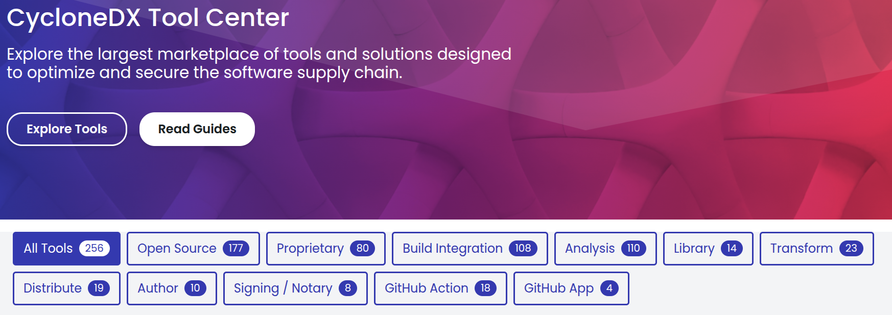

== Génération d'un SBOM

[.step]
* externes à l'application ?
* intégrés dans l'application ?
* multi-technos ?
* conteneurs ?
* intégrable facilement dans une CI ?!

[.notes]
--
* Quelques considérations
* pouvons-nous toucher au code ?
* devons-nous déployer à grande échelle ?
--

=== !

[.notes]
--
* et ce n'est que ce qui a été recensé par CycloneDX
* SPDX : 50aine de tools
* nous allons en voir certains plus populaires que d'autres
--

=== Outils externes

[.step]
* *Syft* préconisé par Github, Bitbucket
* *Gemnasium* / *Trivy* préconisés par Gitlab
* *Docker Scout*
* *cdxgen* de l'OWASP
* *sbom-tool* de Microsoft

[.notes]
--
* regardons comment le mettre en place
--

=== Docker Scout

[.large-code-exemple]
--

[source,bash, highlight=1..3|4..13|14..19|21..23]
----
--> docker scout cves [IMAGE]
✓ Image stored for indexing
✓ Indexed 79 packages

pkg:npm/express@4.17.1

    ✗ HIGH CVE-2022-24999 [OWASP Top Ten 2017 Category A9 - Using Components with Known Vulnerabilities]
      https://scout.docker.com/v/CVE-2022-24999
      Affected range : <4.17.3
      Fixed version  : 4.17.3
      CVSS Score     : 7.5
      CVSS Vector    : CVSS:3.1/AV:N/AC:L/PR:N/UI:N/S:U/C:N/I:N/A:H

36 vulnerabilities found in 11 packages
CRITICAL     2
HIGH         20
MEDIUM       9
LOW          4
UNSPECIFIED  1

What`s next:
View base image update recommendations
→ docker scout recommendations [IMAGE]
----

--

[.notes]
--
* Possibilité d'enroller votre propre registre,
* ce qui nous intéresse c'est la génération de SBOM
--

=== Docker Scout

[source,bash]
----
docker scout sbom --format spdx [IMAGE]
docker scout sbom --format cyclonedx [IMAGE]
----

=== Github Actions

[source,yaml]
----
# Scan des dépendances avec Syft
- uses: anchore/sbom-action@v0
  with:
    image: "${REGISTRY_URL}/mon_image:X.X.X"

- uses: anchore/sbom-action@v0
  with:
    path: ./build/
----

[.notes]
--
* https://github.com/marketplace/actions/anchore-sbom-action
--

=== Github

image::images/github_export_sbom.png[]

[.notes]
--
* extension de la CLI gh
--

=== Gitlab

[source,yaml]
----
# Scan des dépendances avec Gemnasium
stages:
  - test

include:
  - template: Jobs/Dependency-Scanning.gitlab-ci.yml
----

=== Gitlab

[source,yaml]
----
# Scan des conteneurs avec Trivy
stages:
  - test

include:
  - template: Jobs/Container-Scanning.gitlab-ci.yml

container_scanning:
  variables:
    CS_IMAGE: "${REGISTRY_URL}/mon_image:X.X.X"
    CI_REGISTRY: "$REGISTRY_URL"
    CI_REGISTRY_USER: "$USERNAME"
    CI_REGISTRY_PASSWORD: "$PASSWORD"
----

=== Merge de SBOM

[.large-code-exemple]
--

[source,yaml, highlight=1..3|4..17]
----
include:
  - template: Jobs/Dependency-Scanning.gitlab-ci.yml
  - template: Jobs/Container-Scanning.gitlab-ci.yml

merge sboms:
  stage: merge-sboms
  image:
    name: cyclonedx/cyclonedx-cli:0.25.1
    entrypoint: [""]
  script:
    - find . -name "*sbom*.json"
      -exec cyclonedx merge
      --output-file merged-sbom.json
      --input-files "{}" +
  artifacts:
    paths:
      - merged-sbom.json
----

--

[%notitle]
=== Scan dépendances vs conteneurs

image::images/scan_dependances_conteneurs.svg[]

[.notes]
--
* distro2sbom permet de générer le SBOM d'un OS!
--

=== Récapitulatif

image::images/comparatif.svg[]

=== Inconvénients

[.step]
* dépendance utilisée uniquement lors du build
* dépendance non utilisée dans le projet

[.notes]
--
* exemple : Quarkus type "-deployment"
* résultat : il manque des dépendances
--

=== Outils à intégrer dans vos applications

[.step]
* Plugin Maven et Gradle *CycloneDX*
* 05/2024 : Support *Spring Boot 3.3.0*
* 08/2024 : Extension *io.quarkus:quarkus-cyclonedx*

[.notes]
--
* Venant du monde Java ...
* Ma préconisation : Outils à intégrer dans vos applications + scan de conteneurs
--

=== Signature de SBOM

* *cdxgen* de l'OWASP
* *cosign* de Sigstore

[.notes]
--
* garantir intégrité et authenticité
* cosign : outil open-source conçu pour signer et vérifier les artefacts logiciels
--

=== !

. Emergence des SBOM ✅
. Outils de génération ✅
. *Outils d'agrégation et analyse*
. L'univers des BOM

