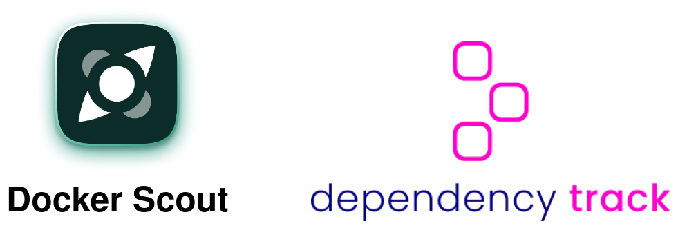

[%notitle]
== Dashboards

[.notes]
--
* Attention Docker Scout gratuit pour projet open source et petites entreprises
--

[%notitle]
=== Docker Scout

[%notitle]
=== Docker Scout

[%notitle.columns.is-vcentered]
=== Dependency Track

[.column.is-one-third]
image:images/dependency-track.svg[]

[.column]
****
[.step]
* 2013
* Open Source
* Développé par l'OWASP
****

=== !

image::images/dependency_track_integrations.png[]

=== Démo!

[.notes]
--
* EPSS : Système de Score de Prédiction d'Exploitation
* probabilité qu'une vulnérabilité logicielle soit exploitée dans la nature
* audit => faux positifs
* recherche d'une CVE type log4shell
* règle (policy), licences :
* BusyBox : application Unix qui fournit plusieurs utilitaires de ligne de commande dans un seul exécutable
* Licence GPL : le produit qui inclut une licence GPL doit être lui-même sous licence GPL et doit rendre disponible le code source
* paramètres
// TODO creuser VEX et VDR
--

[%notitle.white.background]
=== Dependency Track

[source,yaml]
----
services:
  dtrack-apiserver:
    image: dependencytrack/apiserver
    ports:
      - '8081:8080'

  dtrack-frontend:
    image: dependencytrack/frontend
    depends_on:
      - dtrack-apiserver
    environment:
      - API_BASE_URL=http://localhost:8081
    ports:
      - "8080:8080"
----

[.notes]
--
* base H2 par défaut, possibilité de passer à PostgreSQL
--

[%notitle.white.background]
=== Dependency Track

image::images/pipeline.svg[]

=== !

[source,bash]
----
curl -X POST http://localhost:8081/api/v1/bom \
  -H "Content-Type: multipart/form-data" \
  -H "X-API-Key: YOUR_API_KEY" \
  -F "project=OBJECT_IDENTIFIER" \
  -F "bom=@target/bom.json"
----

[.notes]
--
* Plugin Jenkins existant
--

=== !

. Emergence des SBOM ✅
. Outils de génération ✅
. Outils d'agrégation et analyse ✅
. *L'univers des BOM*

